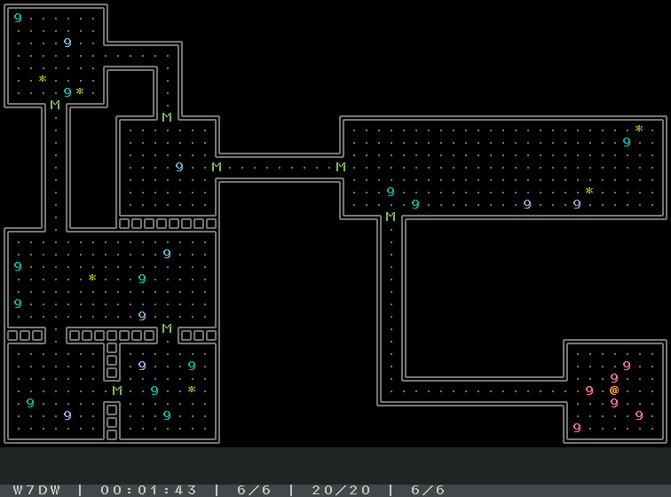

# RTS-RLG

This is a simple, roguelike-style real time strategy game.
The code is so compact that it'll be good example to use TDL, the roguelike library for python.

## Rule

Give orders to your unit to
collect all items as fast as possible!

## Units

- **0~9(red)** : Your unit
- **0~9(blue, cyan, purple)** : Enemy unit

The number means unit's HP. Unit will be destroyed when it comes to 0.
Currently there is no differences in colors of enemy,.

## Others

- **M(green)** : Breakable gate
- **\*(yellow)** : Item to collect
- **@** : Goal to bring item

The keyword showed on bottom left means random seed. To specify specific seed, edit *seed.json*.

## How to Play

- **left click** to select your unit, press **ctrl** to multiple selection.
- **right click** to move your selected unit to specific place.
  - After arrived specified place, your units will battle enemy, break gate, or carry item automatically.

## How to launch game

You have to install Python to your system. Python version should be 3.4 or above. Then launch *rts_rlg.py*!

## Credits

- library
  - TDL (New BSD License)
- font
  - PixelMplus (M+ FONT LICENSE)

[That tutorial](http://www.roguebasin.com/index.php?title=Complete_Roguelike_Tutorial,_using_python%2Blibtcod) is very helpful for development, thank you.

## License

New BSD License
